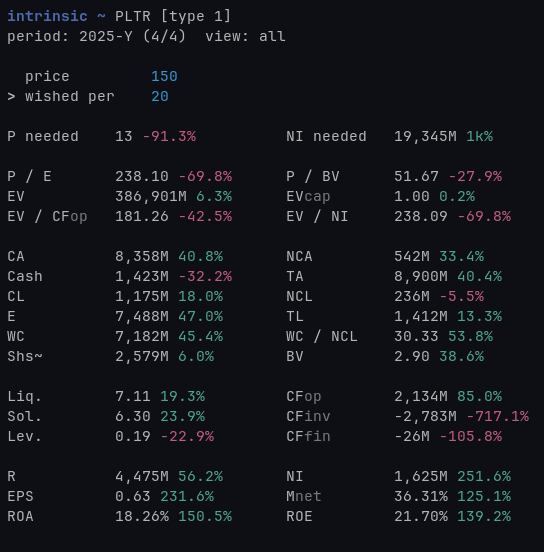

# intrinsic

Analyze stocks from the terminal. Track your companies with a fast ncurses + SQLite workflow. Distributed as a **Nix-only** package.

<p align="center">
  
</p>

The name intrinsic comes from Benjamin Graham’s famous concept of intrinsic value. The true worth of a company based on its fundamentals, rather than market speculation. The app is designed to bring this philosophy into your workflow, giving you a clear, data-driven view of the businesses you’re evaluating.

## Main dependencies

- C++20
- ncurses
- SQLite
- CMake + Ninja
- Nix (installation, build, update)

## Supported platforms

- Linux: `x86_64`, `aarch64`
- macOS: `x86_64`, `aarch64`
- Windows (WSL2): use Linux package/install flow inside WSL (`x86_64`, `aarch64`).

WSL notes:
- Run install/update commands from a WSL shell, not native PowerShell/cmd.
- App data/settings are persisted in the WSL Linux filesystem (same Linux paths as above).
- Clipboard copy (`c`) requires one of: `wl-copy`, `xclip`, or `xsel` to be available in WSL.

## Install and compile

- Install to your user profile (enables the `intrinsic` command):
```bash
nix profile add github:viiictordotcom/intrinsic#default
```

How it works:
- `nix profile add` builds (if needed) and installs the app in your user profile.
- Build artifacts are handled by Nix in the store; no manual build script is required.

## Update

Rolling channel only (no version pinning):
- `nix profile upgrade intrinsic --refresh` checks upstream and updates to latest available revision.

Optional in-app update:
1. Open `Settings`.
2. Press `U`, then press `U` again to execute update.
3. Restart `intrinsic` after update.

## Typical flow

1. Install once:
```bash
nix profile add github:viiictordotcom/intrinsic#default
```
2. Launch:
```bash
intrinsic
```
3. Update later:
```bash
nix profile upgrade intrinsic --refresh
```
Or in-app: open `Settings`, press `U`, then press `U` again.

## Usage and key bindings

Global:
- `q`: quit
- `h`: home
- `?`: help
- `s`: settings

Home view:
- `a`: add record
- `space`: search mode
- `esc`: exit search
- `arrow keys`: move selection / page navigation
- `enter`: open selected ticker

Ticker view:
- `left/right`: previous/next period
- `up/down`: switch input field (`price`, `wished per`)
- `PageUp/PageDown`: scroll metrics
- `y`: toggle yearly-only view
- `e`: edit selected period
- `x`: delete selected period
- `c`: copy period + derived metrics to clipboard
- `Backspace/Delete`: edit active input
- `esc`: back to home

Add/Edit view:
- `arrow keys`: move field/cursor
- `enter`: validate and open confirm prompt
- `y` / `n`: confirm or cancel write
- `esc`: cancel and return

Settings view:
- `H`: toggle help hints
- `S`: toggle ticker sort key
- `O`: toggle sort direction
- `T`: toggle TTM mode
- `U`: update (double-press confirmation)
- `N`: nuke/reset data + settings (double-press confirmation)

## Inputs

Required:
- `ticker`
- `period`

Can be submitted empty:
- `cash and equivalents`
- `current assets`
- `non-current assets`
- `current liabilities`
- `non-current liabilities`
- `revenue`
- `net income`
- `eps`
- `operations`
- `investing`
- `financing`

Ticker field:
- Normalized to uppercase
- Allowed chars: `A-Z`, `0-9`, `.`
- Max length: 12
- Consecutive dots are collapsed

Period field:
- Format: `YYYY-TYPE`
- Allowed types: `Y`, `Q1`, `Q2`, `Q3`, `Q4`, `S1`, `S2`

Examples:
- `2024-Y`
- `2025-Q3`
- `2023-S1`

## Metrics

Metrics are shown for the selected period in Ticker view.

### TTM mode (`Settings` -> `T`)

- `TTM` means trailing twelve months.
- For `Q*` periods, TTM uses the sum of the latest 4 quarterly values.
- For `S*` periods, TTM uses the sum of the latest 2 semiannual values.
- For `Y` periods, TTM does not apply (yearly values are already full-year).
- TTM is applied to `EPS`, `Net Profit`, and `CFop` inputs used by derived metrics.
- With `TTM on`, valuation/derived metrics are smoothed when enough valid history exists.
- With `TTM off`, metrics use only the selected period values.
- With `TTM off` on quarterly/semiannual data, metrics can look more volatile or seasonally distorted (for example temporarily higher/lower `P / E`, `EV / NP`, `EV / CFop`, and `Score`).
- If TTM is on but the required history is incomplete/invalid, the app falls back to the selected period values.

### Change values (`... %`)

- Most metrics show a change suffix vs the same period in the previous year (`YYYY-<same type>`).
- If the previous same-period row is missing, or a needed denominator is zero/invalid, the change suffix is omitted.
- Absolute-value metrics use: `((current - previous) / abs(previous)) * 100`.
- Ratio metrics use sign-aware rules:
    - If both values are negative, an improvement is shown when absolute value gets smaller.
    - If previous is negative and current is positive, change is shown as a positive crossover.
    - Otherwise, standard ratio delta is used: `((current - previous) / previous) * 100`.
- For valuation multiples where lower is better (`P / E`, `P / BV`, `EVcap`, `EV / CFop`, `EV / NP`), change coloring is inverted in UI.
- `p needed` and `NP needed` are not YoY metrics:
- `p needed` change is relative to the typed `price`.
- `NP needed` change is relative to current/TTM net profit baseline.

### Input fields

- `price`: typed share price used by price-dependent metrics.
- `wished per`: target P/E multiple used for target calculations.
- Input format for both fields: digits plus one decimal point, max length 16.
- If `price` is empty/zero/invalid, price-dependent metrics render as `--`.

### Input-related metrics

- `Score`: composite valuation score from `EV / CFop`, `P / E`, and `P / BV` (details below).
- `p needed`: `round(wished per * eps_used)`. In TTM mode, `eps_used` is TTM EPS when available for `Q*`/`S*`, otherwise period EPS.
- `NP needed`: required net profit implied by current `price` and `wished per`.

### Glossary

- `P / E`: price-to-earnings
- `P / BV`: price-to-book value
- `EV`: enterprise value
- `EVcap`: `EV / market cap`
- `EV / CFop`: `EV / cash flow from operations`
- `EV / NP`: `EV / net profit`
- `Score`: valuation score from ratio mix below
- `p needed`: price implied by `wished per` and EPS
- `NP needed`: net profit needed for current `price` at `wished per`
- `CA`: current assets
- `Cash`: cash and equivalents
- `NCA`: non-current assets
- `TA`: total assets (`CA + NCA`)
- `CL`: current liabilities
- `NCL`: non-current liabilities
- `TL`: total liabilities (`CL + NCL`)
- `E`: equity (`TA - TL`)
- `WC`: working capital (`CA - CL`)
- `WC / NCL`: working capital to non-current liabilities
- `Shs~`: approximate shares (`net profit / EPS`, rounded)
- `BV`: book value per share (`equity / Shs~`)
- `Liq.`: liquidity (`CA / CL`)
- `Sol.`: solvency (`TA / TL`)
- `Lev.`: leverage (`TL / E`)
- `CFop`: cash flow from operations
- `CFinv`: cash flow from investing
- `CFfin`: cash flow from financing
- `R`: revenue
- `NP`: net profit
- `EPS`: earnings per share
- `Mnet`: net margin (`NP / R`)
- `ROA`: return on assets (`NP / TA`)
- `ROE`: return on equity (`NP / E`)

### Score

<details>
<summary><strong>Score</strong> is determined as follows:</summary>

Base conditions:

- **NA**: if `price` is not valid, or `Net Profit`, `Shs~`, `EV` (via `EVcap`), or `P/BV` are not valid
- **0**: if `EPS <= 0` or `BV <= 0` or `Operating CF <= 0` or `Net Profit <= 0`
- **10**: if none of the above are met and `EV <= 0`
- Otherwise: `Score = W1*R1 + W2*R2 + W3*R3`

Ratios:

- `R1 = 10 * (1 - (EV/OCF)/50)`, if `EV/OCF < 50`, else `0`
- `R2 = 10 * (1 - (P/E)/50)`, if `P/E < 50`, else `0`
- `R3 = 10 * (1 - (P/BV)/20)`, if `P/BV < 20`, else `0`

Weights:

| Case | W1 (EV/OCF) | W2 (P/E) | W3 (P/BV) |
| --- | --- | --- | --- |
| All ratios available | 0.4 | 0.3 | 0.3 |
| EV/OCF not available | - | 0.5 | 0.5 |

</details>
